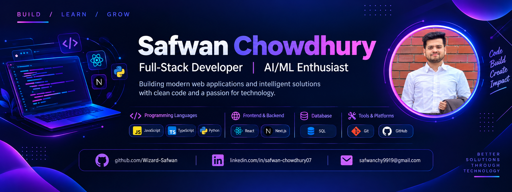

<!-- Banner -->

<h1 align="center">Safwan Chowdhury</h1>

  

---

# 💫 About Me:
A Computer Science and Engineering graduate passionate about building modern web applications and exploring AI/ML technologies.  🌱 Currently learning Full-Stack Web Development with Next.js, React, and TypeScript. 💻 Interested in Software Engineering, AI/ML, and Computer Vision. 🚀 Enjoy building practical projects and solving real-world problems through technology. 🤝 Always eager to learn new technologies and collaborate on meaningful projects. 📫 Reach me at safwanchy9919@gmail.com

## 🌐 Socials:
    

# 💻 Tech Stack:
                                           
# 📊 GitHub Stats:
 
 

### ✍️ Random Dev Quote

---

